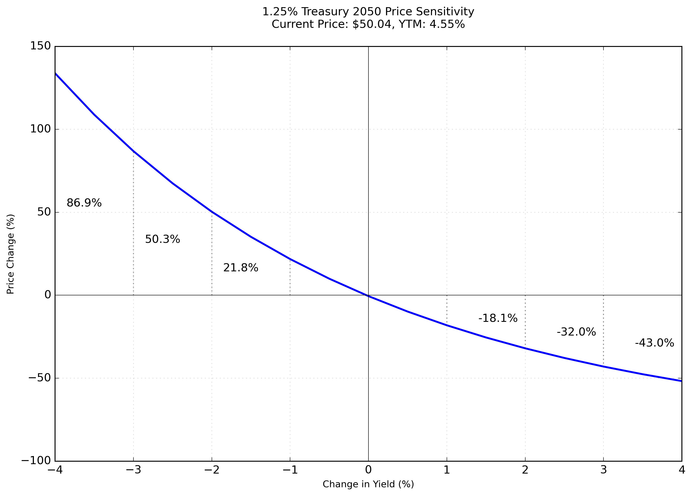
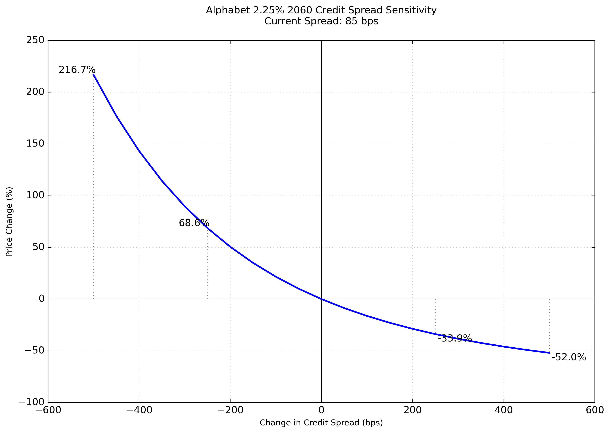
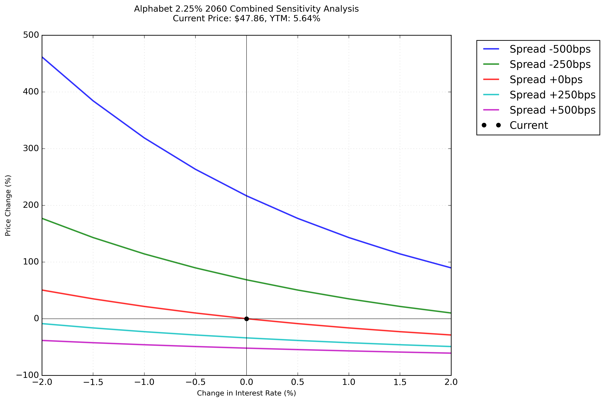
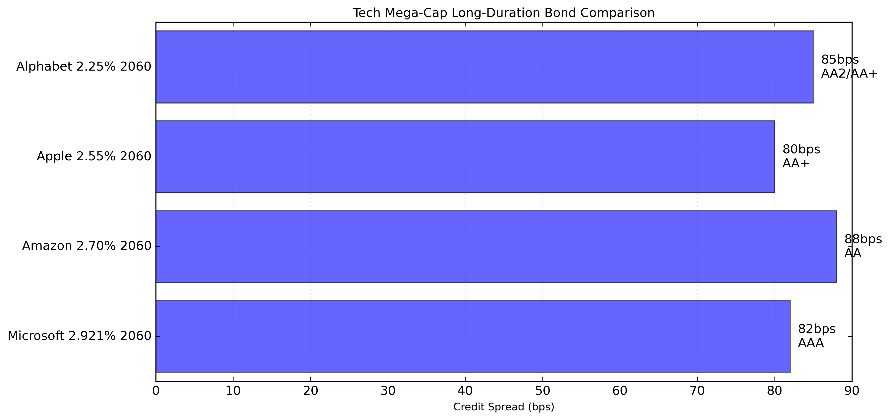
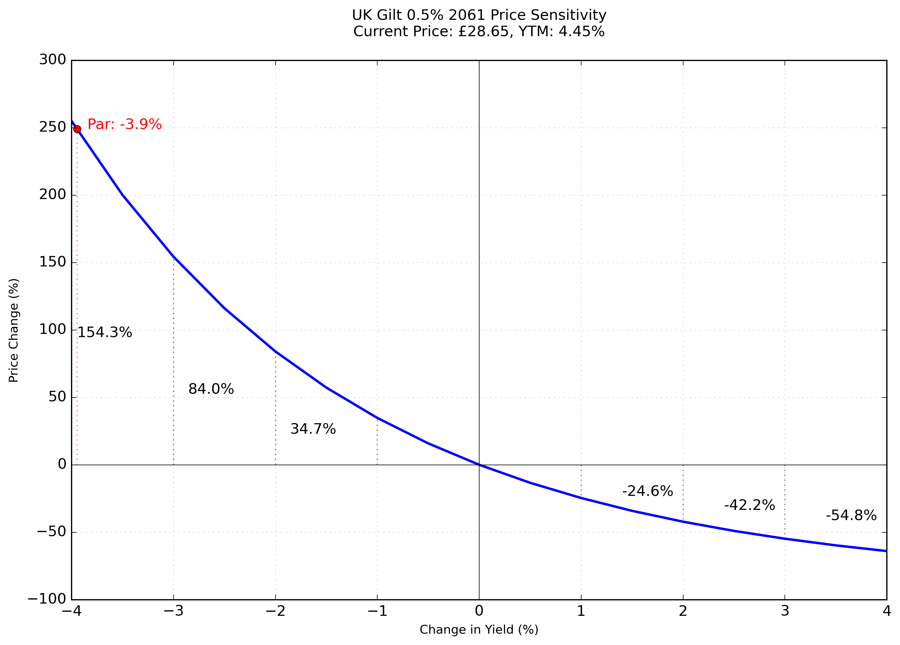
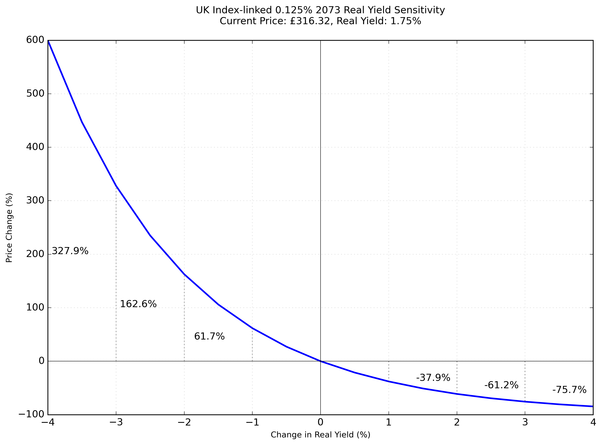
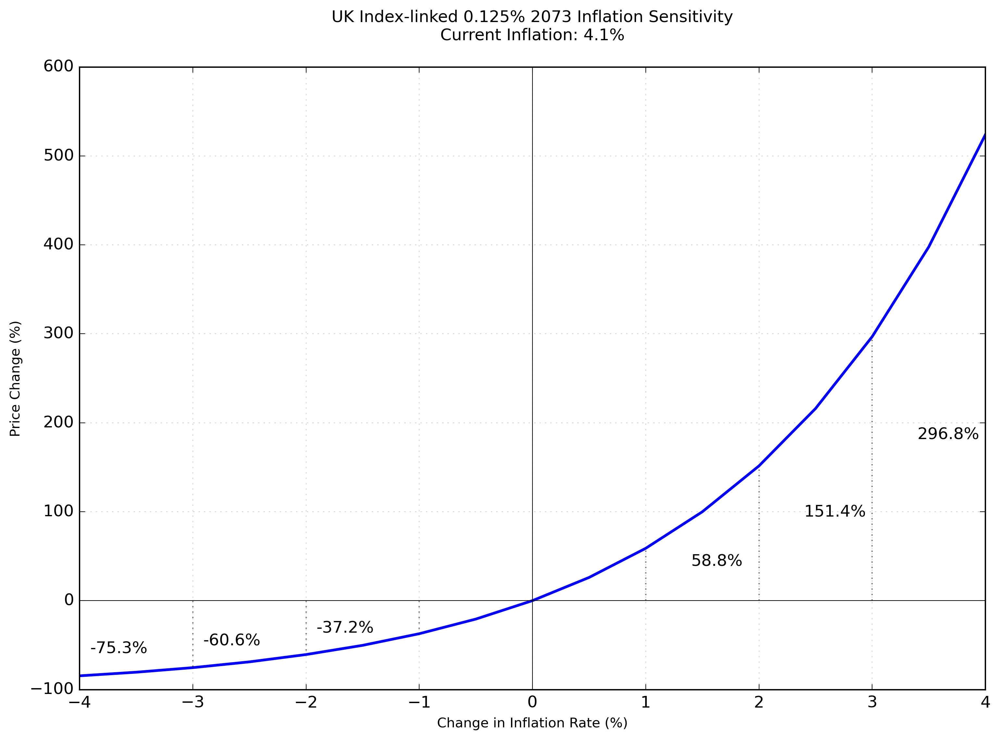
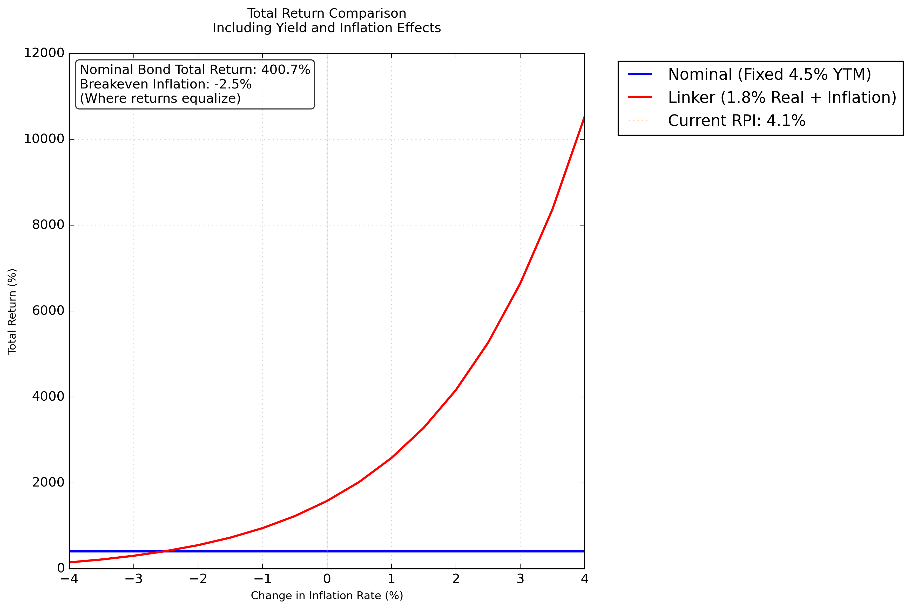
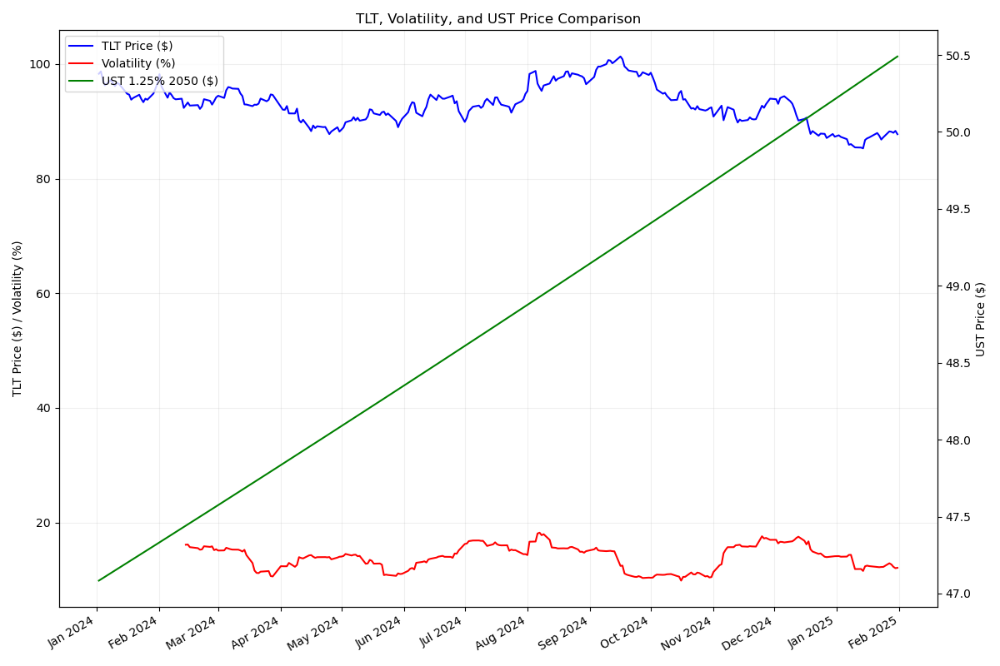

# Treasury and Corporate Bond Analysis

A Python tool for analyzing bond price sensitivity to market changes, focusing on three key areas:
1. US Treasury 1.25% 2050 - Pure interest rate risk
2. Alphabet 2.25% 2060 - Combined interest rate and credit risk
3. UK Inflation-Linked Analysis - Real yield and inflation risk

## Understanding Bond Price Sensitivity

### What Makes Bond Prices Move?
Bond prices change primarily due to two factors:
1. Interest Rate Changes (affects all bonds)
2. Credit Risk Changes (affects corporate bonds only)

### Interest Rate Risk and Convexity
When interest rates change, bond prices move in the opposite direction. This relationship is captured by two key metrics:

1. **Duration**: The first-order (linear) price sensitivity
   - Example: A duration of 17.89 means a 1% rise in rates should cause a 17.89% price decline
   - Works well for small rate changes
   - Simple rule: Price Change ≈ -Duration × Rate Change
   - Linear approximation becomes less accurate for larger moves

2. **Convexity**: The bond price's curvature effect
   - Makes bonds more valuable by creating an asymmetric return profile
   - Helps in two ways:
     * Limits price declines when rates rise
     * Enhances price gains when rates fall
   - More important for longer-dated bonds
   - Example from our Treasury analysis:
     * 4% rate rise = 55% price decline
     * 4% rate fall = 89% price gain
     * Without convexity, both would be about 72%



### Credit Risk: The Corporate Bond Component
Corporate bonds face an additional risk: changes in the company's creditworthiness.

1. **Credit Spreads Explained**:
   - Extra yield investors demand over Treasury rates
   - Measured in basis points (bps) where 100 bps = 1%
   - Reflects market's view of company's credit risk
   - Example: Alphabet's 85 bps spread means investors demand 0.85% extra yield
   - Fun fact: While negative spreads seem implausible (why pay more for more risk?), 
     they're not impossible! With Alphabet (AA2/AA+) and the US Treasury (Aaa/AA+) 
     sharing an S&P rating, we're just one more US downgrade away from some 
     interesting conversations about what "risk-free" really means! 😉

2. **Credit Spread Sensitivity**

- Shows how Alphabet bond price changes with credit spread moves
- Wide range (±500bps) captures stress scenarios like:
  * Credit rating downgrades
  * Market stress periods
  * Industry-specific challenges
- Similar convex shape to interest rate sensitivity

3. **Combined Risk Analysis**

- Real-world scenario analysis
- Shows five different credit spread scenarios
- Each line shows rate sensitivity at that spread level
- Key observations:
  * Risks can compound (rates up + spreads wider)
  * Or offset (rates up + spreads tighter)
  * Stress scenarios often see both moving adversely

4. **Peer Comparison Context**

- Compares major tech companies' credit spreads
- Shows relative market perception of credit risk
- Tighter spread = Lower perceived risk
- Current spreads (in bps):
  * Microsoft (AAA): 82
  * Apple (AA+): 80
  * Alphabet (AA2/AA+): 85
  * Amazon (AA): 88

## Developed Market Bonds and Inflation-Protected Securities

### Global Real Yield Landscape
Current real yields across major markets:
- UK: +1.75% (UKTI 0.125% 2073) - Trading below par, reflecting positive real yield
- US: +2.00% (TIPS 30Y)
- Germany: +0.75% (DBR i/l 2046)
- Japan: +0.50% (JGBi 2052)

This dispersion tells us:
- All major markets now showing positive real yields
- Significant shift from negative yield environment
- Markets pricing in sustained tight monetary policy
- (The insurance premium has turned into a positive carry! 📈)

### UK Government Bonds
Analysis of ultra-long dated nominal and inflation-linked Gilts, focusing on:
1. UKT 0.5% 2061 - A low-coupon, long-duration conventional Gilt
2. UKTI 0.125% 2073 - An ultra-long inflation-linked Gilt

#### Nominal Gilt Analysis

- Shows extreme duration risk in ultra-long, low-coupon bonds
- Price changes are highly asymmetric due to convexity
- Marks the yield change required to reach par (100 pence)
- Demonstrates why these bonds are favored by liability-matching investors

#### Inflation-Linked Gilt Analysis
Three key risk factors analyzed:

1. **Real Yield Sensitivity**

- Shows price response to changes in real yields
- Demonstrates even greater duration risk than nominal bonds
- Particularly relevant given current negative real yields

2. **Inflation Sensitivity**

- Direct price impact of changing inflation expectations
- Critical for understanding inflation protection mechanics
- Shows upside potential in high inflation scenarios

3. **Breakeven Analysis**

- Compares nominal vs inflation-linked bond values
- Shows breakeven inflation rate (where returns equalize)
- Includes historical context with recent RPI peaks
- Helps assess relative value between nominal and real bonds

### Cross-Market Comparison

1. **Structure Differences**:
   - UK: RPI-linked (until 2030 reform)
   - US: CPI-linked
   - Eurozone: HICP-linked
   - Japan: CPI-linked
   - (Different inflation measures = different protection! 📊)

2. **Market Dynamics**:
   - UK: Pension-driven demand
   - US: Most liquid market
   - Eurozone: Fragmented across countries
   - Japan: Heavy central bank presence

3. **Current Themes**:
   - Real yield convergence
   - Inflation expectation normalization
   - Policy divergence impacts
   - (Markets are like restaurants - same menu, different prices! 🍽️)

### Understanding Inflation Protection (or "Why Your Money Might Not Buy That Coffee Tomorrow")

Imagine you lend someone $100 today, and they promise to pay you back $105 in a year. Sounds good, right? 
Well... what if a cup of coffee that costs $5 today costs $6 next year? 🤔

This is where inflation-protected bonds come in, and they're basically the bond market saying "We got you!"

#### How It Works (A Simple Story)
1. **Regular Bond**: 
   - You lend $100
   - Get $2 each year (2% coupon)
   - Get $100 back at the end
   - Meanwhile, inflation is eating your lunch (literally!)

2. **Inflation-Protected Bond**:
   - You lend $100
   - The $100 grows with inflation
   - Your coupons grow with inflation
   - It's like having a tiny economist adjusting your returns daily

#### The Plot Twist: Real Yields and Market Evolution
Current real yield of +1.75% tells an interesting story:
- "Inflation protection now comes with positive carry..."
- "...a dramatic shift from the negative yields of 2020-2022..."
- "...when central banks flooded markets with liquidity"
- (Think of it as getting paid to own insurance, rather than paying a premium 😉)

#### Historical Context
The journey of UK real yields shows a complete regime change:
- Pre-2008: Positive real yields (2-3% range)
- 2009-2021: Gradually went negative with QE
- 2022: Brief panic to -4% during inflation spike
- 2023-24: Strong reversal to positive territory
- Now: Solidly positive, reflecting tight monetary policy

#### Why This Matters Now
1. **Market Psychology**:
   - Real yields near zero suggest balanced inflation expectations
   - Far cry from the "inflation forever" fears of 2022
   - But still showing some desire for protection

2. **Policy Impact**:
   - Bank of England's tough stance on inflation
   - Market believing the "higher for longer" message
   - Real yields responding to policy credibility

3. **Investment Implications**:
   - Linkers no longer look extremely expensive
   - But still offer valuable inflation insurance
   - Especially relevant for liability matching
   - (Like having home insurance even when there's no fire forecast 🏠)

## Overview

This project provides tools to analyze and visualize:
- Price sensitivity to yield changes
- Modified duration and convexity effects
- Linear vs actual price approximations
- Inflation and real yield impacts

## Key Features

### Bond Mathematics
- Zero-coupon bond pricing
- Yield to Maturity (YTM) calculation using Newton's method
- Modified duration calculation
- Convexity analysis

### Analysis Tools
- Price change predictions using:
  - Linear approximation (duration only)
  - Convexity-adjusted approximation
  - Exact calculation
- Visual representation of price sensitivity
- Detailed comparative analysis table

## Installation

1. Clone the repository:
```bash
git clone https://github.com/tmopencell/bondmath.git
cd bondmath
```

2. Install required packages:
```bash
pip install -r requirements.txt
```

## Usage

Run the analysis:
```bash
python treasurybondmath.py
python corpdebtmath.py
python ukandinflationbonds.py
```

This will generate:
1. Treasury bond analysis and visualization
2. Corporate bond analysis and credit spread sensitivity
3. UK gilt and inflation-linked analysis

## Requirements
- Python 3.x
- NumPy
- SciPy
- Matplotlib

## License
MIT

## Author
tmopencell

## Contributing
Pull requests are welcome. For major changes, please open an issue first to discuss what you would like to change.

## TLT Options and Treasury Price Analysis

The iShares 20+ Year Treasury Bond ETF (TLT) provides exposure to long-dated U.S. Treasury bonds, primarily holding Treasury securities that have a remaining maturity greater than 20 years. This makes it a key instrument for:
- Trading long-duration Treasury exposure
- Hedging interest rate risk
- Expressing views on long-term rates

### Analysis Components

This project analyzes three key metrics:
1. TLT ETF Price - reflects the market value of the underlying Treasury portfolio
2. Historical Volatility - calculated as 30-day rolling volatility, annualized
3. Treasury Bond Prices - calculated using real-time yield data



### Market Insights

The relationship between these metrics provides valuable insights:
- Rising volatility often indicates market uncertainty about future rate paths
- When TLT price diverges from underlying Treasury prices, it may signal changing supply/demand dynamics
- Periods of high volatility typically correspond to Federal Reserve policy shifts or major economic data releases

The historical volatility of TLT is particularly informative because:
- Higher volatility suggests market participants are uncertain about long-term rates
- Low volatility periods often indicate consensus about the rate environment
- Volatility spikes can precede significant moves in Treasury yields
